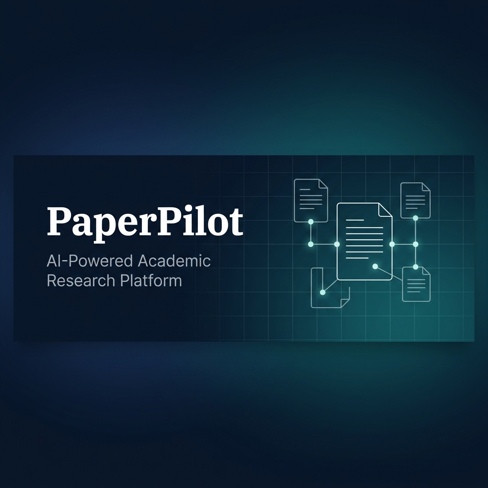
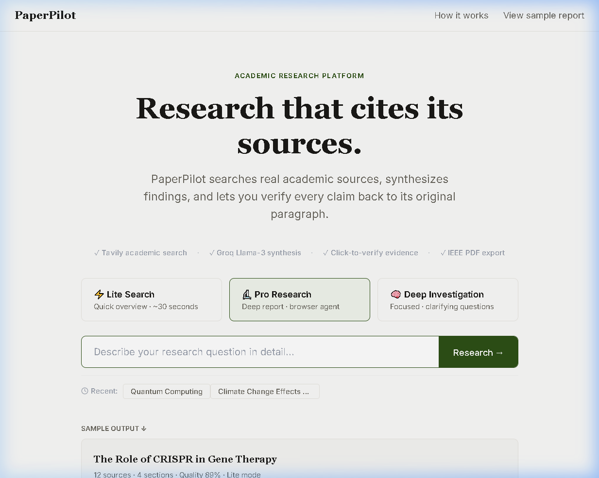
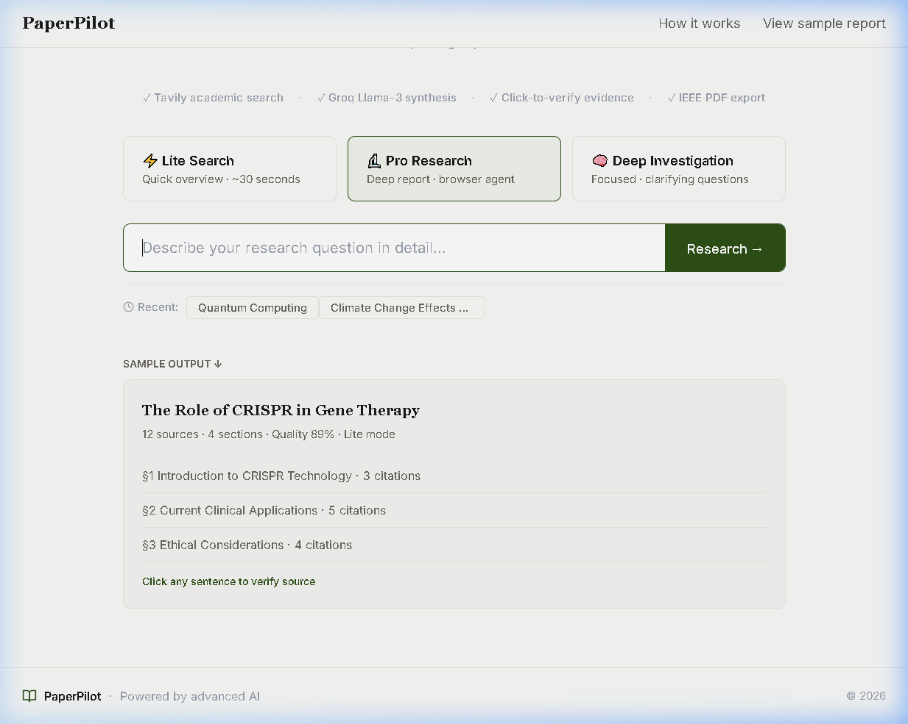
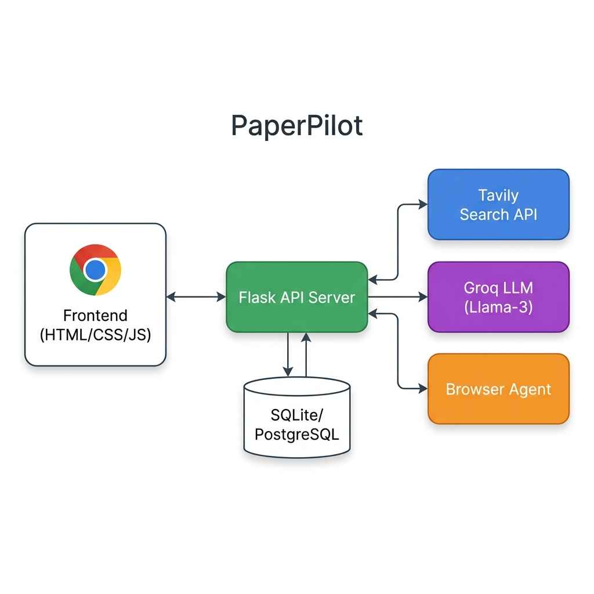

<p align="center">
  
</p>

<p align="center">
  <strong>AI-Powered Academic Research Platform</strong><br/>
  Search real sources. Synthesize findings. Verify every claim.
</p>

<p align="center">
  <a href="#features"></a>
  <a href="#tech-stack"></a>
  <a href="#tech-stack"></a>
  <a href="#tech-stack"></a>
  <a href="LICENSE"></a>
</p>

<p align="center">
  <a href="#quick-start">Quick Start</a> •
  <a href="#features">Features</a> •
  <a href="#architecture">Architecture</a> •
  <a href="#api-reference">API Reference</a> •
  <a href="#deployment">Deployment</a> •
  <a href="#contributing">Contributing</a>
</p>

---

## 📸 Preview

<p align="center">
  
</p>

<p align="center">
  
</p>

---

## 🎯 What is PaperPilot?

**PaperPilot** is a full-stack academic research platform that automates the entire research workflow — from source discovery to synthesis to citation verification. Unlike conventional AI wrappers, PaperPilot searches real academic databases, extracts full-text content from live sources, and lets users **verify every AI-generated claim** back to its original paragraph.

### The Problem

Researchers spend **60–70% of their time** on manual source discovery, reading, and cross-referencing. Existing AI tools either hallucinate citations or provide shallow summaries without verifiable evidence.

### The Solution

PaperPilot provides a three-tier research pipeline that adapts to the depth you need:

| Mode | Speed | Sources | Use Case |
|------|-------|---------|----------|
| ⚡ **Lite Search** | ~30s | 8–12 | Quick literature overviews |
| 🏛️ **Pro Research** | ~2min | 15–25 | In-depth reports with browser agent |
| 🔬 **Deep Investigation** | ~5min | 20–30+ | Focused research with clarifying questions |

---

## ✨ Features

### Core Research Pipeline
- **Multi-Source Academic Search** — Tavily API queries across academic databases, Wikipedia, and curated blogs simultaneously
- **AI-Powered Synthesis** — Groq Llama-3 generates structured, multi-section research reports with inline citations
- **Evidence Verification (RAG)** — Click any AI-generated sentence to see the original source paragraph it was derived from
- **IEEE-Format PDF Export** — One-click export to professionally formatted academic PDFs with table of contents

### Three Research Modes

#### ⚡ Lite Search
Instant research for quick literature reviews. Enter a topic, get a structured report in under 30 seconds.

#### 🏛️ Pro Research
Full-depth research pipeline with:
- **Dynamic Intake Form** — AI-generated chips to refine research scope
- **Research Planner** — Auto-generated section plan before execution
- **Browser Agent** — Live Playwright-powered browser that extracts full-text from paywalled or JS-rendered sources
- **Stealth Scraper Fallback** — Multi-strategy extraction (Trafilatura → BeautifulSoup → Regex) when direct access fails

#### 🔬 Deep Investigation
Guided research mode that asks 3 clarifying questions to understand your specific needs, then generates a tailored plan and executes a focused deep-dive.

### Platform Features
- **Research History** — Persistent storage of all past research sessions with SQLAlchemy
- **Smart Caching** — LRU cache with configurable TTL to avoid redundant API calls
- **Rate Limiting** — Per-IP rate limiting to prevent abuse (configurable)
- **Inline Editor** — Overleaf-style document editor for refining AI-generated reports
- **Responsive UI** — Clean, minimal interface inspired by Linear and Notion design systems

---

## 🏗️ Architecture

<p align="center">
  
</p>

```
┌─────────────────────────────────────────────────────────────────┐
│                        FRONTEND                                 │
│              HTML / CSS / Vanilla JavaScript                     │
│         index.html  ·  editor.html  ·  style.css                │
└──────────────────────────┬──────────────────────────────────────┘
                           │  REST API (JSON)
┌──────────────────────────▼──────────────────────────────────────┐
│                     FLASK API SERVER                             │
│                      api_server.py                               │
│                                                                  │
│  ┌──────────┐  ┌──────────────┐  ┌────────────────┐             │
│  │   Lite   │  │     Pro      │  │     Deep       │             │
│  │ Research │  │   Research   │  │  Investigation │             │
│  └────┬─────┘  └──────┬───────┘  └───────┬────────┘             │
│       │               │                  │                       │
│  paper_fetch.py  pro_research.py  deep_research.py               │
└──────────────────────────┬──────────────────────────────────────┘
                           │
        ┌──────────────────┼──────────────────┐
        ▼                  ▼                  ▼
┌──────────────┐  ┌──────────────┐  ┌──────────────────┐
│  Tavily API  │  │   Groq API   │  │  Browser Agent   │
│  (Search &   │  │  (Llama-3    │  │  (Playwright +   │
│   Extract)   │  │   Synthesis) │  │   browser-use)   │
└──────────────┘  └──────────────┘  └──────────────────┘
        │                                     │
        ▼                                     ▼
┌──────────────┐                    ┌──────────────────┐
│ RAG Service  │                    │ Stealth Scraper  │
│ (Evidence    │                    │ (Trafilatura +   │
│  Matching)   │                    │  BS4 Fallback)   │
└──────────────┘                    └──────────────────┘
        │
        ▼
┌──────────────┐
│  SQLite /    │
│  PostgreSQL  │
│  (Sessions)  │
└──────────────┘
```

---

## 🛠️ Tech Stack

| Layer | Technology | Purpose |
|-------|-----------|---------|
| **Frontend** | HTML5, CSS3, Vanilla JS | Responsive UI with zero build step |
| **Backend** | Python 3.12, Flask 3.x | REST API server |
| **LLM** | Groq Cloud (Llama-3-70B) | Report synthesis & analysis |
| **Search** | Tavily API | Academic source discovery & extraction |
| **Browser Automation** | Playwright + browser-use | Live web browsing agent |
| **Evidence Engine** | Custom fuzzy matcher (difflib) | Source verification without heavy ML dependencies |
| **Content Extraction** | Trafilatura, BeautifulSoup4 | Multi-strategy web scraping |
| **PDF Generation** | ReportLab | IEEE-format academic PDFs |
| **Database** | SQLAlchemy (SQLite / PostgreSQL) | Research session persistence |
| **CLI Output** | Rich | Terminal formatting and progress |

---

## 🚀 Quick Start

### Prerequisites

- **Python 3.12+**
- **Groq API Key** — [Get one free at groq.com](https://console.groq.com)
- **Tavily API Key** — [Get one free at tavily.com](https://app.tavily.com)

### Installation

```bash
# 1. Clone the repository
git clone https://github.com/umanggoel21/paperpilot.git
cd paperpilot

# 2. Create and activate virtual environment
python -m venv .venv
# Windows
.venv\Scripts\activate
# macOS/Linux
source .venv/bin/activate

# 3. Install dependencies
pip install -r requirements.txt

# 4. Install Playwright browsers (required for Pro Research browser agent)
playwright install chromium

# 5. Configure environment variables
cp .env.example .env
# Edit .env and add your API keys
```

### Environment Variables

Create a `.env` file in the project root:

```env
GROQ_API_KEY=gsk_your_groq_api_key_here
TAVILY_API_KEY=tvly-your_tavily_api_key_here
```

### Run

```bash
python api_server.py
```

The application will start on `http://localhost:5000`.

```
+--------------------------------------------+
|   PaperPilot API Server                    |
|                                            |
|   Frontend:  http://localhost:5000          |
|   API:       http://localhost:5000/api      |
|   Health:    http://localhost:5000/api/health|
|                                            |
|   Keys: GROQ=OK  TAVILY=OK                |
+--------------------------------------------+
```

---

## 📡 API Reference

### Health Check

```http
GET /api/health
```

**Response:**
```json
{
  "status": "ok",
  "service": "PaperPilot API",
  "features": {
    "pro_search": true,
    "database": true,
    "browser_agent": true,
    "rag": true,
    "stealth_scraper": true
  }
}
```

### Lite Research

```http
POST /api/research
Content-Type: application/json

{ "topic": "CRISPR Gene Therapy Applications" }
```

**Response:**
```json
{
  "topic": "CRISPR Gene Therapy Applications",
  "sections": [
    {
      "title": "Introduction to CRISPR Technology",
      "content": "...",
      "citations": ["[1]", "[2]"]
    }
  ],
  "sources": [...],
  "total_sources": 12,
  "quality_score": 89,
  "elapsed_seconds": 28.4
}
```

### Pro Research

```http
# Step 1: Generate intake chips
POST /api/pro/intake-chips
{ "topic": "..." }

# Step 2: Generate research plan
POST /api/pro/plan
{ "topic": "...", "purpose": "...", "audience": "..." }

# Step 3: Execute research
POST /api/pro/execute
{ "context": {...}, "plan": {...}, "agent_findings": {...} }
```

### Deep Investigation

```http
# Step 1: Generate clarifying questions
POST /api/deep/questions
{ "topic": "...", "config": { "sources": 5, "length": "medium" } }

# Step 2: Generate research plan
POST /api/deep/plan
{ "topic": "...", "config": {...}, "answers": [...] }

# Step 3: Execute deep research
POST /api/deep/execute
{ "topic": "...", "config": {...}, "answers": [...], "plan": [...] }
```

### PDF Generation

```http
POST /api/pdf
Content-Type: application/json

{ "report": {...}, "enhance": true }
```

### Evidence Verification

```http
POST /api/evidence
Content-Type: application/json

{
  "sentence": "CRISPR-Cas9 has shown 95% efficiency in clinical trials",
  "session_id": "abc123"
}
```

### Browser Agent

```http
# Start agent session
POST /api/agent/start
{ "topic": "...", "search_queries": ["..."] }

# Stream progress (SSE)
GET /api/agent/stream/{session_id}

# Get final results
GET /api/agent/result/{session_id}
```

<details>
<summary><strong>📋 Full Endpoint Table</strong></summary>

| Method | Endpoint | Description |
|--------|----------|-------------|
| `GET` | `/api/health` | Health check with feature flags |
| `POST` | `/api/research` | Lite Search pipeline |
| `POST` | `/api/research/enhanced` | Enhanced research with RAG |
| `POST` | `/api/pdf` | Generate PDF from report |
| `GET` | `/api/pdf/download/{filename}` | Download generated PDF |
| `GET` | `/api/history` | Cached research history |
| `GET` | `/api/history/db` | Database research history |
| `POST` | `/api/pro/intake-chips` | Pro Search intake chips |
| `POST` | `/api/pro/plan` | Pro Search research plan |
| `POST` | `/api/pro/execute` | Pro Search full execution |
| `POST` | `/api/deep/questions` | Deep Investigation questions |
| `POST` | `/api/deep/plan` | Deep Investigation plan |
| `POST` | `/api/deep/execute` | Deep Investigation execution |
| `POST` | `/api/evidence` | Evidence verification query |
| `GET` | `/api/evidence/sources/{id}` | Session indexed sources |
| `POST` | `/api/agent/start` | Start browser agent |
| `GET` | `/api/agent/stream/{id}` | Agent progress SSE stream |
| `GET` | `/api/agent/result/{id}` | Agent final results |
| `GET` | `/api/agent/screenshot/{id}` | Agent screenshot poll |

</details>

---

## 📁 Project Structure

```
paperpilot/
├── api_server.py           # Flask REST API — routes, caching, rate limiting
├── paper_fetch.py          # Lite Search — Tavily search + Groq synthesis
├── pro_research.py         # Pro Research — intake, planning, execution
├── deep_research.py        # Deep Investigation — questions, plans, execution
├── browser_agent.py        # Playwright browser agent (browser-use)
├── pdf_generator.py        # IEEE-format PDF generation (ReportLab)
├── rag_service.py          # Evidence matching engine (fuzzy difflib)
├── scraper_service.py      # Stealth content extractor (multi-strategy)
├── database.py             # SQLAlchemy models and session persistence
├── clients.py              # Shared Tavily + Groq client initialization
├── requirements.txt        # Python dependencies
├── .env                    # API keys (not committed)
├── .gitignore              # Git ignore rules
├── frontend/
│   ├── index.html          # Landing page + research UI
│   ├── editor.html         # Inline document editor
│   ├── style.css           # Design system (Linear/Notion aesthetic)
│   └── main.js             # Frontend logic and API integration
├── docs/
│   └── images/             # README screenshots and diagrams
├── report/                 # B.Tech project report chapters (Markdown)
├── scripts/
│   └── diagrams/           # UML and architecture diagram generators
└── output/                 # Generated PDFs and exports (gitignored)
```

---

## 🚢 Deployment

### Render (Backend)

1. Connect your GitHub repository to [Render](https://render.com)
2. Set environment variables (`GROQ_API_KEY`, `TAVILY_API_KEY`)
3. Build command: `pip install -r requirements.txt && playwright install chromium`
4. Start command: `python api_server.py`

### Vercel (Frontend)

1. Connect your GitHub repository to [Vercel](https://vercel.com)
2. Set root directory to `frontend/`
3. Framework preset: Other
4. Build command: (none)
5. Output directory: `./`

### Docker (Self-Hosted)

```dockerfile
FROM python:3.12-slim

WORKDIR /app
COPY requirements.txt .
RUN pip install --no-cache-dir -r requirements.txt \
    && playwright install chromium \
    && playwright install-deps

COPY . .
EXPOSE 5000

CMD ["python", "api_server.py"]
```

```bash
docker build -t paperpilot .
docker run -p 5000:5000 --env-file .env paperpilot
```

---

## ⚙️ Configuration

| Variable | Required | Default | Description |
|----------|----------|---------|-------------|
| `GROQ_API_KEY` | ✅ | — | Groq Cloud API key for Llama-3 |
| `TAVILY_API_KEY` | ✅ | — | Tavily API key for academic search |
| `PORT` | ❌ | `5000` | Server port |
| `FLASK_DEBUG` | ❌ | `false` | Enable Flask debug mode |

### Internal Defaults (configurable in `api_server.py`)

| Setting | Value | Description |
|---------|-------|-------------|
| Cache Size | 50 entries | Max cached research reports |
| Cache TTL | 24 hours | Cache entry lifetime |
| Rate Limit | 5 req/60s | Per-IP request throttle |
| Deep Research Limit | 3/month | Monthly deep research cap per IP |
| Topic Length | 3–500 chars | Allowed topic length range |

---

## 🧪 Testing

```bash
# Verify server health
curl http://localhost:5000/api/health

# Run a Lite Search
curl -X POST http://localhost:5000/api/research \
  -H "Content-Type: application/json" \
  -d '{"topic": "Quantum Computing"}'

# Generate a PDF
curl -X POST http://localhost:5000/api/pdf \
  -H "Content-Type: application/json" \
  -d '{"report": {...}, "enhance": true}'
```

---

## 🔒 Security

- **API keys** are stored in `.env` and never committed to version control
- **Input validation** on all endpoints (topic length, sanitization)
- **Rate limiting** prevents API abuse (configurable per-IP limits)
- **Path traversal protection** on PDF download endpoints
- **CORS** configured for cross-origin frontend requests
- **No hardcoded secrets** in the codebase

---

## 🗺️ Roadmap

- [ ] PostgreSQL migration for production persistence
- [ ] User authentication (OAuth 2.0)
- [ ] Collaborative research sessions
- [ ] Export to LaTeX and DOCX formats
- [ ] Citation style selection (APA, MLA, Chicago, IEEE)
- [ ] Research template library
- [ ] Batch research processing
- [ ] Webhook notifications for long-running deep research

---

## 🤝 Contributing

Contributions are welcome! Please follow these steps:

1. **Fork** the repository
2. **Create** a feature branch (`git checkout -b feature/amazing-feature`)
3. **Commit** your changes (`git commit -m 'Add amazing feature'`)
4. **Push** to the branch (`git push origin feature/amazing-feature`)
5. **Open** a Pull Request

### Development Guidelines

- Follow PEP 8 for Python code
- Use descriptive commit messages
- Add docstrings to all public functions
- Test your changes locally before submitting

---

## 📄 License

This project is licensed under the MIT License. See the [LICENSE](LICENSE) file for details.

---

## 👨‍💻 Author

**Umang Goel**

- GitHub: [@umanggoel21](https://github.com/umanggoel21)

---

<p align="center">
  <strong>PaperPilot</strong> — Research that cites its sources.<br/>
  Built with ❤️ for the academic community.
</p>
